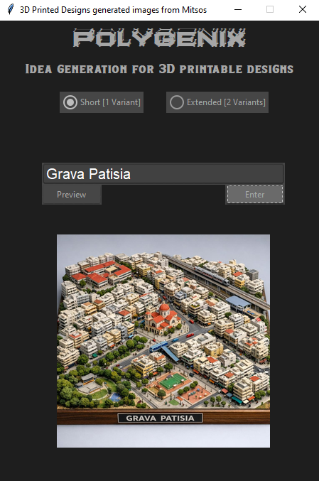

# 3D Printed Designs Image Generation

A Python-based application that transforms user prompts into specialized prompts about 3D printed designs and generates corresponding images.

## Overview

This tool simplifies the process of generating images of 3D printed designs. Simply enter your creative idea, and the program will:
1. Take your initial prompt
2. Intelligently modify it to focus on 3D printed designs
3. Generate a high-quality image based on the enhanced prompt

Perfect for designers, makers, and 3D printing enthusiasts looking for inspiration and design visualization.

## Features

- 🎯 **Smart Prompt Enhancement**: Automatically refines your prompts to emphasize 3D printing design elements
- 🖼️ **Image Generation**: Creates stunning visuals of 3D printed designs
- 💡 **Easy to Use**: Simple and intuitive interface
- 🚀 **Fast Processing**: Quick prompt modification and image generation

## Installation

1. Clone this repository:
```bash
git clone https://github.com/Jimoulis31/3D-Printed-Designs-Image-Generation.git
cd 3D-Printed-Designs-Image-Generation
```

2. Install required dependencies:
```bash
pip install -r requirements.txt
```

## Usage

Run the program:
```bash
python main.py
```

Then:
1. Enter your creative prompt describing what you'd like to visualize
2. The program will enhance it with 3D printing-specific terminology
3. An image will be generated based on the modified prompt
4. Save or share your generated image

## Screenshots

### Program Interface



## Requirements

- Python 3.7+
- See `requirements.txt` for additional dependencies

## Contributing

Contributions are welcome! Please feel free to submit issues or pull requests to improve this project.

## License

This project is licensed under the MIT License - see the LICENSE file for details.

## Author

Created by [Jimoulis31](https://github.com/Jimoulis31)

## Feedback

Have suggestions or found a bug? Please open an issue on the [GitHub Issues](https://github.com/Jimoulis31/3D-Printed-Designs-Image-Generation/issues) page.

---

**Happy designing! 🎨🖨️**
